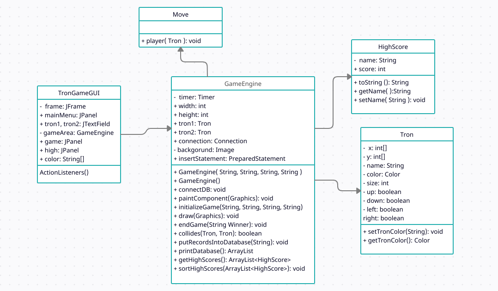

# TronGame

Create a game, with we can play the light-motorcycle battle (known from the Tron
movie) in a top view. Two players play against each other with two motors, where each motor
leaves a light trace behind of itself on the display. The motor goes in each seconds
toward the direction that the player has set recently. The first player can use the WASD
keyboard buttons, while the second one can use the cursor buttons for steering.
A player loses if its motor goes to the boundary of the game level, or it goes to the light
trace of the other player. Ask the name of the players before the game starts, and let them
choose the color of their light traces. Increase the counter of the winner by one in the
database at the end of the game. If the player does not exist in the database yet, then insert
a record for him. Create a menu item, which displays a highscore table of the players for
the 10 best scores. Also, create a menu item which restarts the game.

## Description:

We have to create a tron game based on the game played in the movie Tron. The original idea
is to create two players who have their individual bikes. The bikes each leave a trail behind
them which sort of acts like a wall. If a bike collides with the trail of the other tron’s bike, the
player which collides loses. Similarly, if a tron collides with its own trail, it also loses and the
game ends. The game also ends if it collides with the border of the game as it's not allowed to
go outside it.

Class Diagram:

Function Description:

TronGameGUI():
The function is the constructor of the class TronGameGUI and will build up the board and the
panel and the frame. It will also initiate an instance of the GameEngine class. This function will
ask the user for all his information and the trons color. We can also use it to display the
highscores of the players which are stored in the database. We are also adding a menu in this
function which we can use to perform different operations.

GameEngine():
Game Engine() is the constructor of Game Engine class used for initializing instances of the
Trons. All the key listeners are also used in this class. We are also creating instances of other
classes there. The database is also being managed in this class.

HighScore:
HighScore is another class which is used to store the name and score of the player. We also
have getters and setters in this class.

Tron:
Tron class is used to store the properties of the tron player e.g Color, name, size, their last
traversed positions.

Move:
Move class is used for updating the positions of the Tron in the Array and update where the
Tron will have to move.

